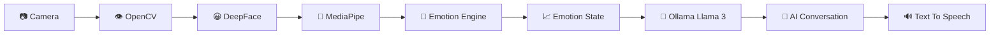
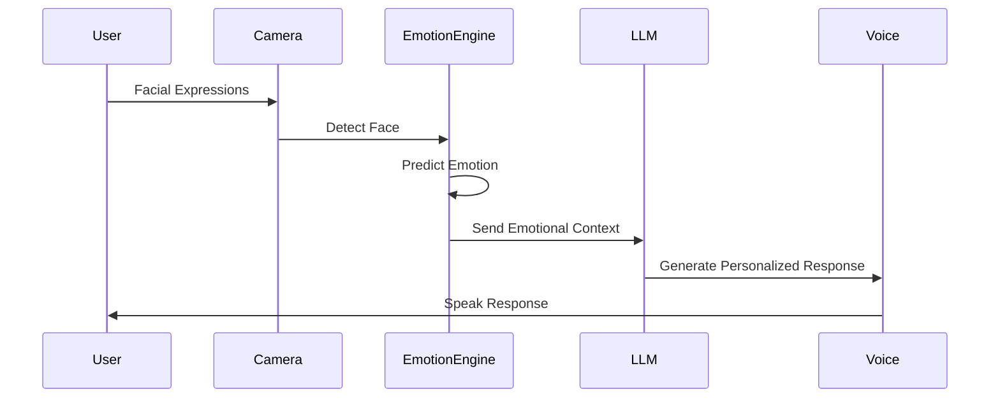

<div align="center">


<p align="center">


</p>

<p align="center">


</p>

</div>

---

# 🧠 EMMA (Emotional Mental Management Assistant)

> **A next-generation AI companion capable of understanding human emotions through facial expression analysis and responding with emotionally aware conversations using Large Language Models.**

EMMA is an intelligent Human Computer Interaction system that continuously analyzes facial expressions using computer vision and deep learning, predicts emotional states in real time, and generates supportive responses using an AI language model.

Unlike traditional chatbots, EMMA understands **how the user feels before deciding what to say.**

---

# 🌍 Vision

Human communication is driven by emotion.

EMMA bridges the gap between artificial intelligence and emotional intelligence by combining facial emotion recognition, conversational AI, and speech synthesis into one unified assistant.

---

# ✨ Features

## 😊 Real-Time Emotion Detection

- Live Webcam Analysis
- Multi-face Detection
- Continuous Emotion Tracking
- Confidence Scoring
- Emotion History Smoothing

---

## 🤖 AI Emotional Assistant

- Emotion-aware Conversations
- Context-based Responses
- Personalized Interaction
- Local LLM Support
- Natural Language Understanding

---

## 🎤 Voice Interaction

- Text-to-Speech
- Natural AI Responses
- Hands-free Interaction

---

## 👁 Computer Vision

- Face Detection
- Facial Landmark Tracking
- Emotion Classification
- Live Video Processing

---

## 📊 Smart Analytics

- Emotion Timeline
- Confidence Visualization
- Detection Statistics
- Session Monitoring

---

## 🔒 Privacy First

- Local AI Processing
- Local Ollama Models
- No Cloud Dependency
- Secure User Sessions

---

# 🚀 Technology Stack

| Layer | Technology |
|--------|------------|
| Language | Python |
| Computer Vision | OpenCV |
| Face Analysis | DeepFace |
| Face Tracking | MediaPipe |
| Deep Learning | TensorFlow |
| LLM | Ollama (Llama 3.2) |
| Voice | pyttsx3 |
| UI | OpenCV GUI / Tkinter |
| Communication | REST API |

---

# 🏗 System Architecture



---

# ⚡ Workflow



---

# 🎯 Supported Emotions

| Emotion | Detection |
|----------|-----------|
| 😊 Happy | ✅ |
| 😔 Sad | ✅ |
| 😠 Angry | ✅ |
| 😲 Surprise | ✅ |
| 😨 Fear | ✅ |
| 🤢 Disgust | ✅ |
| 😐 Neutral | ✅ |

---

# 📂 Project Structure

```text
EMO-BOT

├── EMOBOT_code1.py

├── EMOBOT_code2.py

├── EMOBOT_code3.py

├── Requirements.txt

└── README.md
```

---

# ⚙ Installation

### Clone Repository

```bash
git clone https://github.com/HARIESHSARAVANAN/EMO-BOT.git
```

---

### Install Dependencies

```bash
pip install -r Requirements.txt
```

---

### Start Ollama

```bash
ollama run llama3.2:3b
```

---

### Run Application

```bash
python EMOBOT_code3.py
```

---

# 🌟 Highlights

✅ Real-Time Facial Emotion Recognition

✅ AI Powered Emotional Conversations

✅ Deep Learning Based Prediction

✅ MediaPipe Face Tracking

✅ TensorFlow Integration

✅ Local Large Language Model

✅ Voice Response System

✅ Modern Professional Interface

---

# 🔬 Future Enhancements

- 🧠 Multimodal Emotion Recognition

- 🎙 Speech Emotion Analysis

- ❤️ Heart Rate Integration

- ⌚ Wearable Device Support

- 📱 Mobile Application

- 🌍 Multi-language AI

- ☁ Cloud Synchronization

- 📊 Emotion Analytics Dashboard

- 🩺 Mental Wellness Recommendation Engine

---

# 🎓 Academic Applications

- Human Computer Interaction

- Mental Health Assistance

- AI Research

- Emotion Recognition

- Computer Vision

- NLP

- Intelligent Virtual Assistants

---

# 🏆 Why EMMA?

Traditional chatbots respond only to text.

EMMA first understands the user's emotional state through facial analysis and then generates context-aware, empathetic responses using an AI language model, creating a more natural and human-centered interaction.

---

# 🤝 Contributing

```text
🍴 Fork Repository

🌿 Create Feature Branch

💻 Commit Changes

🚀 Push Branch

🎉 Open Pull Request
```

---

# 👨‍💻 Author

<div align="center">

# Hariesh Saravanan

### AI Engineer • Computer Vision • Deep Learning • NLP • Cybersecurity

<a href="https://github.com/HARIESHSARAVANAN">


</a>

</div>

---

<div align="center">

## ⭐ If you found EMMA useful, please give this repository a Star!


</div>
